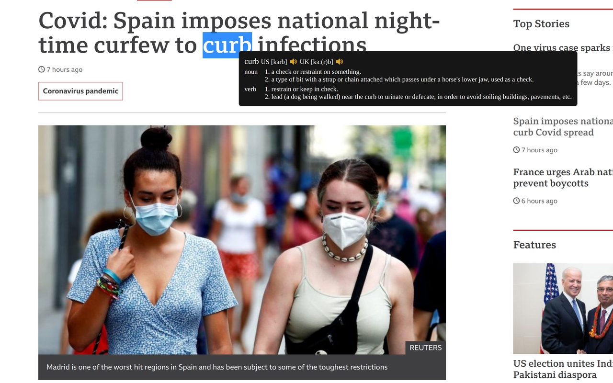
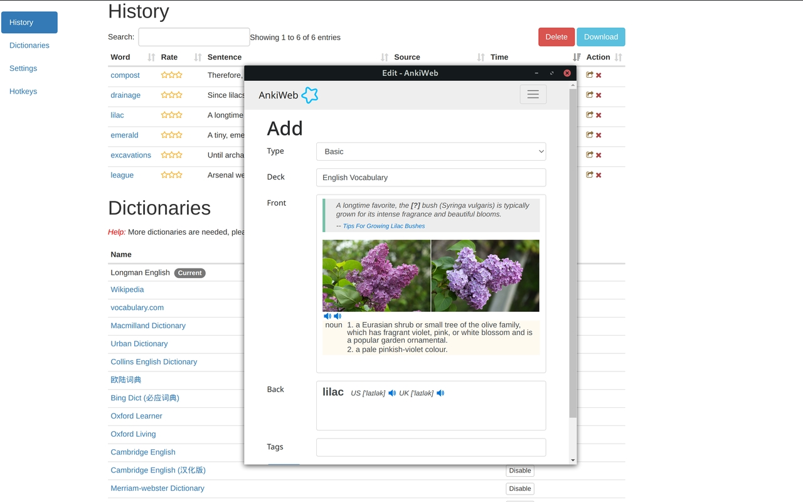
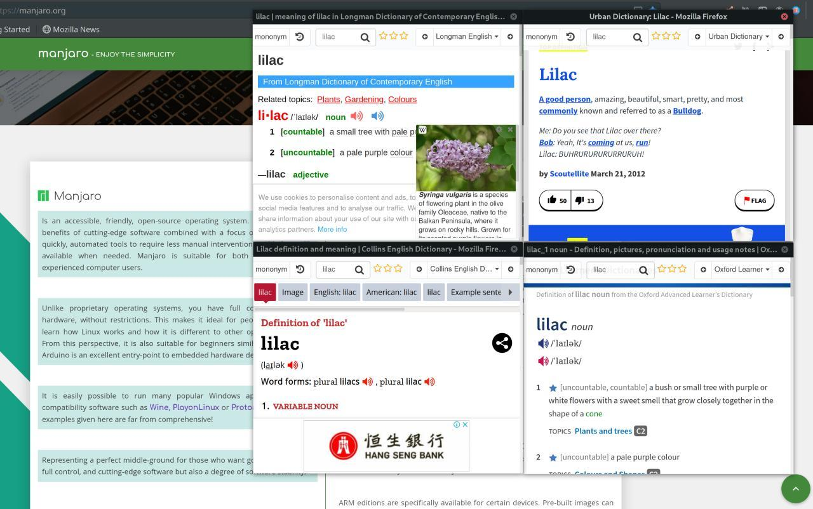

# Dictionariez (dictionaries)

This app, which is currently supported on Chrome and Firefox, helps facilitate your language learning by marking words in articles, looking up in various dictionaries, and exporting to Anki. 

Just double click on a word you will see the definition shows up right on the position. This is the fastest way to look up. In this case the app has builtin dictionaries to support **English, Chinese, Japanese, Korean (aka CJK), German, Spanish, French, Italian, Portuguese, Russian and Tajik** languages, I am happy to add more languages support if you are interested.    
And click on the app's icon, a popup window will show to let you look up any words in tons of your favorite dictionaries. This way you can look more deeply on the words. And it just looks like a traditional dictionary app. It has autocompletion function, word history, keyboard shortcuts, real human pronunciation and many more. Some example dictionaries include Urban dictionary, Oxford, Cambridge, Longman, Thesaurus, Merrian webster, Collins and Wikipedia etc.   

My goal is providing a universal tool to look up any word in any language, currently [more dictionaries are needed](https://pnlpal.dev/topic/52/help-more-dictionaries-are-needed), and more user reviews are wanted to improve its usability.  
As you can see, I am a language learner, Chinese is my mother tongue, English and Japanese are what I am learning right now. I wish this small tool could help the others like me. So if you have any suggestion please tell me, I am glad to hear feedbacks.  

Join me on [Telegram](https://t.me/worldlanguagelearner) & [Discord](https://discord.gg/sazRac4kSa) to learn languages together. We would talk about linguistics, programming, and even have virtual meetings once for a while. Let's build this community together.

With the launch of [pnlpal community](https://pnlpal.dev/topic/2/), you can share your reading with pals all over the world now. No matter it's a news story, or a technical review, or even a youtube video. As long as it benefits our programming and language community, you could share it. [Check it](https://pnlpal.dev) by yourself. Let's learn together, and grow together.

# Install

- [chrome web store](https://chrome.google.com/webstore/detail/dictionaries/diojcfpekhhnndfmggknljpnfpcccbhc) *Sometimes older because of Chrome's delayed review.*

- [firefox addon](https://addons.mozilla.org/en-US/firefox/addon/dictionaries/) *Newest*

- [Microsoft Edge](https://microsoftedge.microsoft.com/addons/detail/dictionaries-one-to-rule/jdgglojanbnghagoeffacmjodigadoof) *Sometimes older because of Microsoft's delayed review.*

- [Download crx file](build.crx) *Newest. Uninstall the other version before you install it. But every time your have to upgrade by yourself.*

# Screenshot

# More dictionaries are needed!  

[See here.](https://pnlpal.dev/topic/52/help-more-dictionaries-are-needed) 

# Build

1. use `yarn` or `npm install` to install requirements.
2. `npm start` to start a webpack dev-server, add the `build/` directory in your browser's extension page to load the extension.
3. `npm run build` to build the release code. The dest path is `build/`.

# Privacy Policy

[See here](privacy.md)